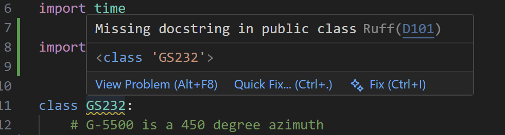

# Development Tooling Overview

This document provides a brief introduction to the tools used in this project. Following these patterns ensures code consistency and minimizes "it works on my machine" errors.

## 1. Dependency Management with `uv`

[`uv`](https://docs.astral.sh/uv/) is our primary tool for managing Python versions, virtual environments, and packages. It is significantly faster than standard `pip` and ensures everyone is using the exact same library versions.

### Adding a Dependency

When you need a new library, use `uv add`. This updates the `pyproject.toml` file and the lockfile automatically.

```bash
# Add a standard dependency
uv add python-dotenv

# Add a development-only dependency (e.g., for testing)
uv add --dev pytest
```

### Removing a Dependency

To clean up unused packages:

```bash
uv remove python-dotenv
```

## 2. Quality Control & Formatting

We use a suite of "linters" and "formatters" to maintain high code quality. These tools catch bugs before you run the code and keep the styling uniform.

| Tool | Purpose | Primary Benefit |
| --- | --- | --- |
| `ruff` | Lints and formats Python code | Helps enforce "best practices" of writing and formatting Python code |
| `ty` | Static type checking / runtime utility | Catches type-related bugs (e.g., passing a string where an int is expected) |
| `markdownlint` | Checks `.md` file syntax | Ensures documentation is readable and standard across all editors |

### How to Leverage Them

#### In-Editor Feedback



As you type in VS Code, these tools provide real-time feedback via "squiggly" underlines:

* **Red:** Errors that may break the code or violate strict rules.
* **Yellow:** Warnings or stylistic suggestions.

#### Applying Fixes

* **Hover:** Hover your mouse over the underlined code to read the error description.
* **Quick Fix:** Click the "Quick Fix..." lightbulb (or press `Ctrl+.` / `Cmd+.`) to see automated solutions.
* **Automatic Formatting:** This project is configured to "Format on Save." Simply saving your file will resolve most layout and spacing issues automatically.

> **Note:** It is highly recommended that you address all warnings before submitting a Pull Request. If you believe a warning is a "false positive", verify to the best of your abilities that it is before explicitly ignoring the warning.

## 3. Generating Documentation

The autoDocstring extension simplifies writing documentation.

* **To use:** Position your cursor directly below a function definition (def function_name():) and type triple quotes (""").
* **Action:** Press Enter to generate a template including arguments, return types, and exceptions.
