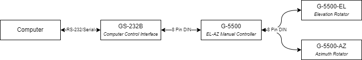

# Yaesu GS-232B Computer Interface for Antenna Rotators
Our ground station will use a Yaesu G-5500DC Azimuth Elevation rotator. This rotator set cannot interface with a computer by itself however.
That's where the GS-232B comes in, this controller sits between a computer and the rotator allow autonomous control.

## How it Works
The GS-232B interfaces over serial (rs-232). The computer is attached via USB to serial adapter.
The wrapper then allows serial commands to be sent via Python, making control of the rotator less
tedious

## Connecting the Computer to the GS-232
> [!NOTE]  
> These instructions are specific to *Linux*
0. Ensure you have the correct drivers for your serial adapter. You can use `dmesg` to verify the adapter was recognized
1. Use `dmesg` to determine the device path, it should be something like `/dev/ttyUSB0`
2. In your Python script use the device path and create a new gs232 reference. The wrapper will ensure the controller responds or will throw an error

## Commands
The interface has several commands outlined below. [Full documentation can be found here](https://static.dxengineering.com/global/images/instructions/ysu-gs-232b_eh.pdf)
This document has a number of typos which make it difficult to understand some of the commands.

| Command | Description | Response |
| ------------- | ------------- |     - |
| H1| 1st help page| Command list |
| H2| 2nd help page | Command list |
| H3| 3rd help page | Command list |
| O | Azimuth null calibration, see [calibration guide](./calibrate.md) | Interactive prompt |
| F | Azimuth voltage calibration helper, see [calibration guide](./calibrate.md) | Interactive prompt |
| O2| Elevation null calibration, see [calibration guide](./calibrate.md) | Interactive prompt |
| F2| Elevation voltage calibration helper, see [calibration guide](./calibrate.md) | Interactive prompt |
| R | Turn azimuth to the right | not tested |
| U | Turn elevation upward | not tested |
| L | Turn azimuth to the left | not tested |
| D | Turn elevation downward | not tested |
| A | Stop movement on the azimuth | None |
| E | Stop movement on the elvation | None |
| S | Stop all movement on both axis | None|
| C | Return the current azimuth in degrees | `AZ=aaa` padded with leading zeros |
| B | Return the current elevation in degrees | `EL=eee` padded with leading zeros |
| C2| Returns the current azimuth and elevation in degrees | `AZ=aaa EL=eee` padded with leading zeros |
|P36| Set the azimuth rotator to use 360 degrees | `mode 360 Degree` |
|P45| Set azimuth rotator to use 450 degrees | `mode 450 Degree` |
| Z | Toggles the azimuth starting point (is the 0???) between north and south, ignored when azimuth is using 450 degrees | `S Center` or `N Center` |
|Xn| Set the azimuth rotator turning speed, between 1-4 ex. `X2` | not tested |
|Maaa| Turn to `aaa` (must be padded with zeros to make 3 digits) degrees azimuth, rotation starts on execution ex. `M042` | not tested |
|Msss aaa bbb ccc ... 3800 | Step through a sequence of azimuth angles waiting `sss` between each step. Allows up to 3800 degrees to be stored ex. `M010 000 012` would start from 0 degrees wait 10 seconds, and move to 12. ex. `M005 100 110 115 123` would start at 100 degrees, wait 5 seconds, move to 110, wait 5s, move to 115 and so on. Rotor will turn to the first azimuth angle immediately, then remaining movement starts on execution of the `T` command. Values are stored until another `M` command is issued and can be reset by running `M` with no parameters | not tested |
| T | Start an automatic timed routine for both the `M` or `W` commands | not tested |
| N | Returns the serial number of currentl selected points and the number of memorized points | `=nnnn =mmmm` |
| Waaa eee | Turn to `aaa` degrees azimuth and `eee` degrees elevation, rotation begins immediately | not tested |
| Wsss aaa eee aaa eee ... 1900| Similar to the M command but with azimuth/elevation pairs instead. Immediately moves to the first pair, then waits for the `T` command before stepping through remaining pairs. Waits `sss` between movement between pairs. | not tested |